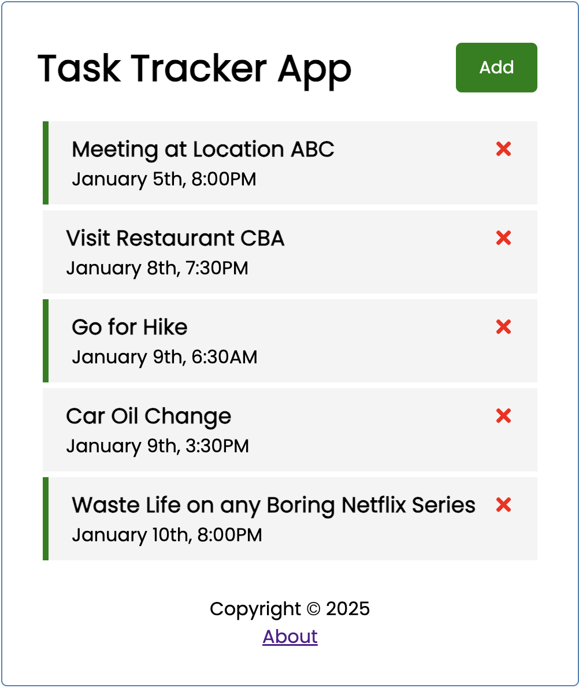

# Task Tracker

A simple task tracker app built using react.js. I built it to freshen up my knowlege.

Concepts used in this app are: Components, State Management, Hooks, Mocked Json Server for backend.

Install
```
npm i
```

Run the App
```
npm start
```

Run the Backend Server
```
npx json-server db.json --port 3001
```

## Some Screen Shots



<br/>


<br/>

